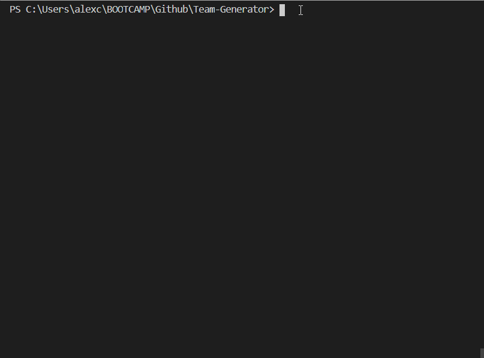
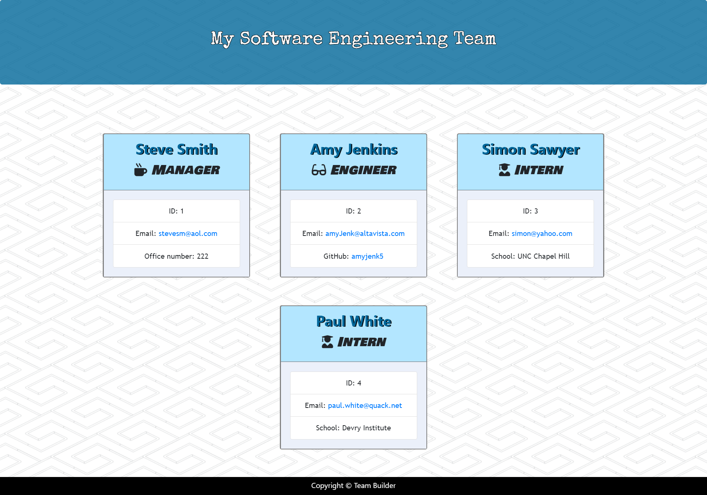
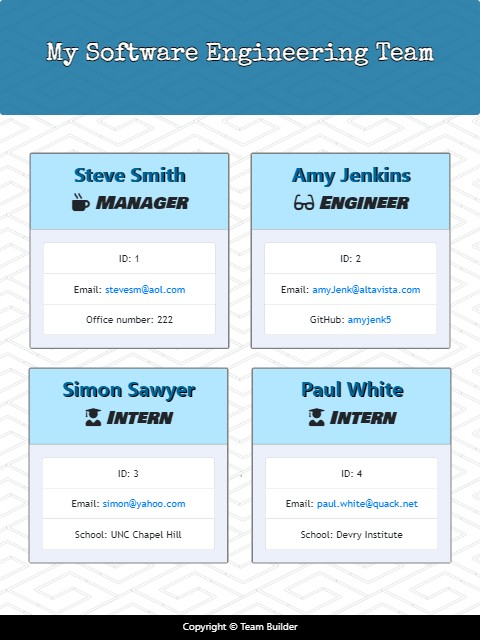
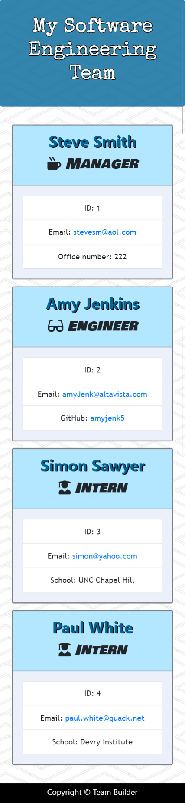

# Team Generator
 &nbsp;&nbsp;&nbsp; 	  &nbsp;&nbsp;&nbsp; 	  
## Table of Contents  

* [Description](#Description)
* [Installation](#Installation)
* [Usage](#Usage)
* [Testing](#Testing)
* [Screenshots](#Screenshots)
* [Built With](#Built-With)

## Description  

  * This is a command line application for building and displaying a software engineering team. 
 
## Installation  

  * Clone this repository from Github and then enter the command 'npm i' to install the necessary dependencies. 
 
## Usage  

  * Answer the questions about your team on the command line.  Once you are finished, a formatted html page will be generated with information about your team members. 

  * Usage demo:

>

 
## Testing  

  * npm run test 
 
 
## Screenshots  
###### Laptop Screenshot    
  
 Ipad Screenshot    

 Iphone Screenshot  

 
## Built With  

* Node.js
* Inquirer - npm package for asking questions on the command line
* Chalk - module for changing text-color in the command line
* Path - module for interacting with the file system
* FS - module for reading and writing to files
* CSS
* Bootstrap Framework
* HTML
